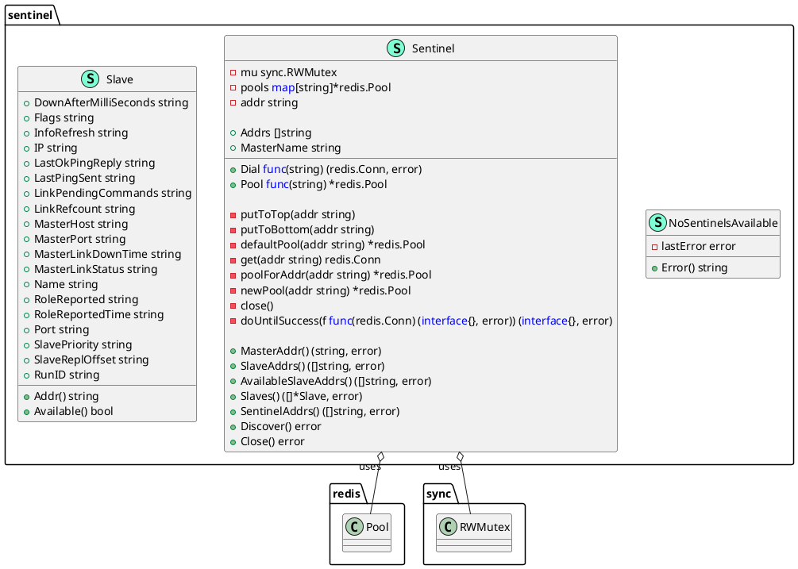

```plantuml
@startuml
namespace sentinel {
    class NoSentinelsAvailable << (S,Aquamarine) >> {
        - lastError error

        + Error() string

    }
    class Sentinel << (S,Aquamarine) >> {
        - mu sync.RWMutex
        - pools <font color=blue>map</font>[string]*redis.Pool
        - addr string

        + Addrs []string
        + MasterName string
        + Dial <font color=blue>func</font>(string) (redis.Conn, error)
        + Pool <font color=blue>func</font>(string) *redis.Pool

        - putToTop(addr string) 
        - putToBottom(addr string) 
        - defaultPool(addr string) *redis.Pool
        - get(addr string) redis.Conn
        - poolForAddr(addr string) *redis.Pool
        - newPool(addr string) *redis.Pool
        - close() 
        - doUntilSuccess(f <font color=blue>func</font>(redis.Conn) (<font color=blue>interface</font>{}, error)) (<font color=blue>interface</font>{}, error)

        + MasterAddr() (string, error)
        + SlaveAddrs() ([]string, error)
        + AvailableSlaveAddrs() ([]string, error)
        + Slaves() ([]*Slave, error)
        + SentinelAddrs() ([]string, error)
        + Discover() error
        + Close() error

    }
    class Slave << (S,Aquamarine) >> {
        + DownAfterMilliSeconds string
        + Flags string
        + InfoRefresh string
        + IP string
        + LastOkPingReply string
        + LastPingSent string
        + LinkPendingCommands string
        + LinkRefcount string
        + MasterHost string
        + MasterPort string
        + MasterLinkDownTime string
        + MasterLinkStatus string
        + Name string
        + RoleReported string
        + RoleReportedTime string
        + Port string
        + SlavePriority string
        + SlaveReplOffset string
        + RunID string

        + Addr() string
        + Available() bool

    }
}


"sentinel.Sentinel""uses" o-- "redis.Pool"
"sentinel.Sentinel""uses" o-- "sync.RWMutex"

@enduml
```
